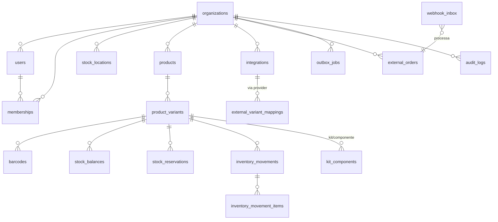

# Modelo de dados

- IDs internos em **UUID**; IDs externos como **String** (suportam > int32).
- Datas em **UTC**; exibição no fuso **America/Sao_Paulo** (formatação no frontend).
- Quantidades **inteiras**; valores monetários em **centavos** (Int).
- O **livro de movimentações** (`inventory_movements`) é a fonte histórica imutável.
  `stock_balances` é uma **projeção** atualizada atomicamente na mesma transação.

## Diagrama (Mermaid)

## Unicidade e índices relevantes

- `product_variants (orgId, skuNormalized)` UNIQUE — SKU único case-insensitive.
- `barcodes (orgId, value)` UNIQUE.
- `stock_balances (orgId, locationId, variantId)` UNIQUE — projeção 1:1.
- `inventory_movements (orgId, idempotencyKey)` UNIQUE — idempotência no banco.
- `webhook_inbox (dedupeKey)` UNIQUE — webhooks repetidos não duplicam.
- `external_variant_mappings (orgId, provider, externalVariantId)` UNIQUE.
- `external_orders (orgId, provider, externalOrderId)` UNIQUE.
- Índices de busca: SKU, barcode `value`, `variantId+createdAt`, `type+createdAt`, `externalOrderNumber`, `groupId`.
